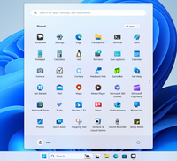
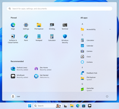
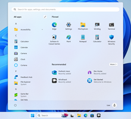

# The Windows 11 start menu styling guide

## Table of contents

* [Introduction](#introduction)
  * [Missing customizations](#missing-customizations)
  * [Contributing](#contributing)
* [Themes](#themes)
* [Custom Acrylic background](#custom-acrylic-background)
* [Remove the search box](#remove-the-search-box)
* [Move pinned app lists](#move-pinned-app-lists)
* [Remove the Recommended section](#remove-the-recommended-section)
* [Remove the user profile button](#remove-the-user-profile-button)
* [Move the power button](#move-the-power-button)

## Introduction

This is a collection of commonly requested start menu styling customizations for
Windows 11. It is intended to be used with the [Windows 11 Start Menu
Styler](https://windhawk.net/mods/windows-11-start-menu-styler) Windhawk mod.

If you're not familiar with Windhawk, here are the steps for installing the mod:

* Download Windhawk from [windhawk.net](https://windhawk.net/) and install it.
* Go to "Mods" in the upper right menu.
* Find and install the "Windows 11 Start Menu Styler" mod.

After installing the mod, open its Settings tab and adjust the styles according
to your preferences.

Some customizations are best to be adjusted with other Windhawk mods. Links to
those mods are provided where applicable.

**See also**: [The Windows 11 taskbar styling
guide](https://github.com/ramensoftware/windows-11-taskbar-styling-guide/blob/main/README.md).

### Missing customizations

If you're looking for a customization that is not listed here, please [open an
issue](https://github.com/ramensoftware/windows-11-start-menu-styling-guide/issues/new).

### Contributing

If you have a start menu styling customization or theme that you would like to
share, please submit a pull request.

## Themes

Themes are collections of styles that can be imported into the Windows 11
Start Menu Styler mod. The following themes are available:

| Link | Screenshot
| ---- | ----------
| [NoRecommendedSection](Themes/NoRecommendedSection/README.md) | [](Themes/NoRecommendedSection/screenshot.png)
| [SideBySide](Themes/SideBySide/README.md) | [](Themes/SideBySide/screenshot.png)
| [SideBySide2](Themes/SideBySide2/README.md) | [](Themes/SideBySide2/screenshot.png)
| [SideBySideMinimal](Themes/SideBySideMinimal/README.md) | [](Themes/SideBySideMinimal/screenshot.png)
| [Windows10 (WIP)](Themes/Windows10/README.md) | [](Themes/Windows10/screenshot.png)

## Custom Acrylic background

To use a custom Acrylic background, target `Border#AcrylicBorder` and override
`Background` with a custom `AcrylicBrush` object, for example:

```
Background:=<AcrylicBrush BackgroundSource="Backdrop" TintColor="Pink" TintOpacity="0.25" />
```

The [`AcrylicBrush`
properties](https://learn.microsoft.com/en-us/uwp/api/windows.ui.xaml.media.acrylicbrush?view=winrt-22621#properties)
can be adjusted as needed.

## Remove the search box

You need to target `StartDocked.SearchBoxToggleButton` with `Height=0`,
`Margin=0,0,0,24` styles and then the search box should be gone on your start
menu.

## Move pinned app lists

You need to target `StartMenu.PinnedList` with `Grid.Row=2` style and then the
pinned app lists should go up, and for "Pinned" text, target
`Windows.UI.Xaml.Controls.Grid#TopLevelRoot > Windows.UI.Xaml.Controls.Grid`
with `Grid.Row=1` style. "All apps" button should have `Grid.Row=1` style. The
target is: `Windows.UI.Xaml.Controls.Grid#TopLevelRoot >
Windows.UI.Xaml.Controls.Border`.

## Remove the Recommended section

To hide the Recommended section, target
`Windows.UI.Xaml.Controls.Grid#ShowMoreSuggestions`,
`Windows.UI.Xaml.Controls.Grid#SuggestionsParentContainer`,
`Windows.UI.Xaml.Controls.Grid#TopLevelSuggestionsListHeader` and set the style
to `Visibility=Collapsed`. In addition, the pinned items can be adjusted to
occupy the whole height by targeting `StartMenu.PinnedList` and setting
`Height=504`.

## Remove the user profile button

Target `StartDocked.UserTileView` with `Visibility=Collapsed`.

## Move the power button

Target `StartDocked.PowerOptionsView` with `Margin=-580,-1330,0,0`.
