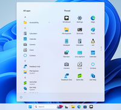
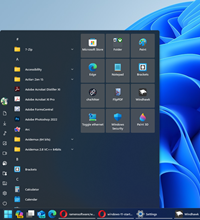
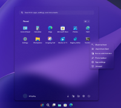
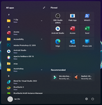
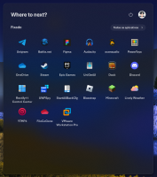
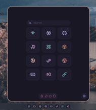
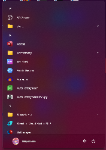

# The Windows 11 start menu styling guide

## Table of contents

* [Introduction](#introduction)
  * [Missing customizations](#missing-customizations)
  * [Contributing](#contributing)
* [Themes](#themes)
* [Custom Acrylic background](#custom-acrylic-background)
* [Remove the search box](#remove-the-search-box)
* [Move pinned app lists](#move-pinned-app-lists)
* [Remove the Recommended section](#remove-the-recommended-section)
* [Remove the user profile button](#remove-the-user-profile-button)
* [Move the power button](#move-the-power-button)
* [Colors](#colors)
  * [Solid color](#solid-color)
  * [Accent colors](#accent-colors)
  * [Transparent color](#transparent-color)
  * [Acrylic effect as color](#acrylic-effect-as-color)
  * [Mica effect as color](#mica-effect-as-color)
  * [Gradient as color](#gradient-as-color)
  * [Image as color](#image-as-color)
  * [Reveal as color](#reveal-as-color)

## Introduction

This is a collection of commonly requested start menu styling customizations for
Windows 11. It is intended to be used with the [Windows 11 Start Menu
Styler](https://windhawk.net/mods/windows-11-start-menu-styler) Windhawk mod.

If you're not familiar with Windhawk, here are the steps for installing the mod:

* Download Windhawk from [windhawk.net](https://windhawk.net/) and install it.
* Go to "Mods" in the upper right menu.
* Find and install the "Windows 11 Start Menu Styler" mod.

After installing the mod, open its Settings tab and adjust the styles according
to your preferences.

Some customizations are best to be adjusted with other Windhawk mods. Links to
those mods are provided where applicable.

**See also**: [The Windows 11 taskbar styling
guide](https://github.com/ramensoftware/windows-11-taskbar-styling-guide/blob/main/README.md),
[The Windows 11 notification center styling
guide](https://github.com/ramensoftware/windows-11-notification-center-styling-guide/blob/main/README.md).

### Missing customizations

If you're looking for a customization that is not listed here, please [open an
issue](https://github.com/ramensoftware/windows-11-start-menu-styling-guide/issues/new).

### Contributing

If you have a start menu styling customization or theme that you would like to
share, please submit a pull request.

## Themes

Themes are collections of styles that can be imported into the Windows 11
Start Menu Styler mod. The following themes are available:

| Link | Screenshot
| ---- | ----------
| [NoRecommendedSection](Themes/NoRecommendedSection/README.md) | [](Themes/NoRecommendedSection/screenshot.png)
| [SideBySide](Themes/SideBySide/README.md) | [](Themes/SideBySide/screenshot.png)
| [SideBySide2](Themes/SideBySide2/README.md) | [](Themes/SideBySide2/screenshot.png)
| [SideBySideMinimal](Themes/SideBySideMinimal/README.md) | [](Themes/SideBySideMinimal/screenshot.png)
| [Windows10](Themes/Windows10/README.md) | [](Themes/Windows10/screenshot.png)
| [TranslucentStartMenu](Themes/TranslucentStartMenu/README.md) | [](Themes/TranslucentStartMenu/screenshot.png)
| [Windows11_Metro10](Themes/Windows11_Metro10/README.md) | [](Themes/Windows11_Metro10/screenshot.png)
| [Fluent2Inspired](Themes/Fluent2Inspired/README.md) | [](Themes/Fluent2Inspired/screenshot.png)
| [RosePine](Themes/RosePine/README.md) | [](Themes/RosePine/screenshot.png)
| [Windows11_Metro10Minimal](Themes/Windows11_Metro10Minimal/README.md) | [](Themes/Windows11_Metro10Minimal/screenshot.png)

## Custom Acrylic background

To use a custom Acrylic background, target `Border#AcrylicBorder` and override
`Background` with a custom `AcrylicBrush` object, for example:

```
Background:=<AcrylicBrush BackgroundSource="Backdrop" TintColor="Pink" TintOpacity="0.25" />
```

The [`AcrylicBrush`
properties](https://learn.microsoft.com/en-us/uwp/api/windows.ui.xaml.media.acrylicbrush?view=winrt-22621#properties)
can be adjusted as needed.

## Remove the search box

You need to target `StartDocked.SearchBoxToggleButton` with `Height=0`,
`Margin=0,0,0,24` styles and then the search box should be gone on your start
menu.

## Move pinned app lists

You need to target `StartMenu.PinnedList` with `Grid.Row=2` style and then the
pinned app lists should go up, and for "Pinned" text, target
`Windows.UI.Xaml.Controls.Grid#TopLevelRoot > Windows.UI.Xaml.Controls.Grid`
with `Grid.Row=1` style. "All apps" button should have `Grid.Row=1` style. The
target is: `Windows.UI.Xaml.Controls.Grid#TopLevelRoot >
Windows.UI.Xaml.Controls.Border`.

## Remove the Recommended section

To hide the Recommended section, target
`Windows.UI.Xaml.Controls.Grid#ShowMoreSuggestions`,
`Windows.UI.Xaml.Controls.Grid#SuggestionsParentContainer`,
`Windows.UI.Xaml.Controls.Grid#TopLevelSuggestionsListHeader` and set the style
to `Visibility=Collapsed`. In addition, the pinned items can be adjusted to
occupy the whole height by targeting `StartMenu.PinnedList` and setting
`Height=504`.

## Remove the user profile button

Target `StartDocked.UserTileView` with `Visibility=Collapsed`.

## Move the power button

Target `StartDocked.PowerOptionsView` with `Margin=-580,-1330,0,0`.

# Colors

In the following examples, we are going to use `Background`, but this
 also works for other properties that accept colors like `Fill`.

### Solid color

```
Background=<color>
```

Replace `<color>` with the desired color.

A color can be a name (e.g. `Red`) or a hex code (e.g. `#FF0000`).

The color can be semi-transparent (e.g. `#80FF0000`). To have a fully
transparent background, use `Transparent`.

### Accent colors

A Color can also be a `ThemeResource` or `StaticResource`. There are many such
styles built into Windows.

```
Background:=<SolidColorBrush Color="{ThemeResource SystemAccentColor}" Opacity="0.8" />
```

Accent colors have different lightness available, like `SystemAccentColorLight2`
or `SystemAccentColorDark1`. The word `Light` or `Dark` is appended at end with
a number ranging from 1-3. Check out [the official Microsoft
docs](https://learn.microsoft.com/en-us/windows/apps/design/style/color#accent-color-palette)
for all variations.

```
Background:=<SolidColorBrush Color="{ThemeResource SystemAccentColorDark2}" Opacity="0.5" />
```

### Transparent color

To have a fully transparent background, use the following style:

```
Background=Transparent
```

### Acrylic effect as color

In order to have an acrylic effect (a blurred background) you can use
`AcrylicBrush`, this comes with `TintOpacity` which defines how much of the
color needs to be applied.

```
Background:=<AcrylicBrush TintColor="Black" TintOpacity="0.8" />
```

You can also mix Acrylic with a variation of an accent color for a more dynamic
look that fits current theme.

```
Background:=<AcrylicBrush TintColor="{ThemeResource SystemAccentColorDark2}" TintOpacity="0.3" />
```

### Mica effect as color

> [!NOTE]
> Unfortunately I haven't figured this out yet. If you have any info please
> contribute by making a pull request.

### Gradient as color

The background can also be a gradient. For example, to have a gradient from
yellow to red to blue to lime green, use the following style:

```
Background:=<LinearGradientBrush StartPoint="0,0.5" EndPoint="1,0.5"><GradientStop Color="Yellow" Offset="0.0" /><GradientStop Color="Red" Offset="0.25" /><GradientStop Color="Blue" Offset="0.75" /><GradientStop Color="LimeGreen" Offset="1.0" /></LinearGradientBrush>
```

### Image as color

The background can also be an image:

```
Background:=<ImageBrush Stretch="UniformToFill" ImageSource="<image>" />
```

Replace `<image>` with your own image, a URL or a local file path.

### Reveal as color

> [!NOTE]
> Reveal is a deprecated XAML feature. It may have issues
> or stop working at any time.

Reveal is the cursor-based illumination effect from Windows 10.

```
Background:=<RevealBorderBrush Color="Transparent" TargetTheme="1" Opacity="1" />
```

```
BorderBrush:=<RevealBorderBrush Color="Transparent" TargetTheme="1" Opacity="1" />
```

ONLY `RevealBorderBrush` can be used, `RevealBackgroundBrush` is unavailable.

`Opacity` can be changed to increase or decrease the intensity of the effect.
