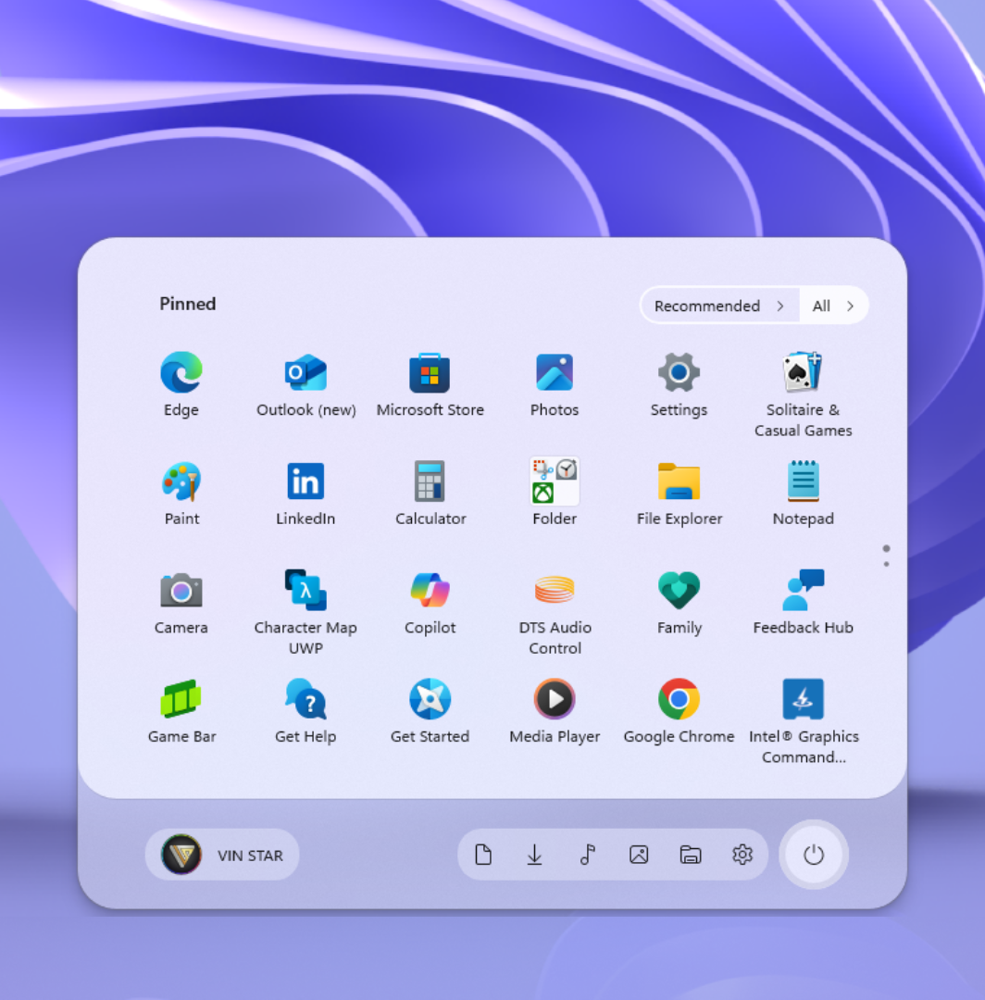

# Down Aero

**Author**: [VIN STAR](https://github.com/vinstartheme)


<!--
## Theme selection

The theme is integrated into the mod, and can be simply selected from the mod's
settings:

* Open the Windows 11 Start Menu Styler mod in Windhawk.
* Go to the "Settings" tab.
* Select the theme and save the settings.
-->
## Manual installation

<!-- The theme styles can also be imported manually. To do that, follow these steps: -->
To import the theme manually, follow these steps:

* Open the Windows 11 Start Menu Styler mod in Windhawk.
* Go to the "Advanced" tab.
* Copy the content below to the text box under "Mod settings" and click "Save".

<details>
<summary>Content to import (click to expand)</summary>

```json
{
  "controlStyles[0].target": "StartDocked.StartSizingFrame",
  "controlStyles[0].styles[0]": "MaxHeight=520",
  "controlStyles[1].target": "Windows.UI.Xaml.Controls.Grid#TopLevelSuggestionsListHeader",
  "controlStyles[1].styles[0]": "Visibility=Collapsed",
  "controlStyles[2].target": "StartMenu.PinnedList",
  "controlStyles[2].styles[0]": "Height=340",
  "controlStyles[3].target": "Windows.UI.Xaml.Controls.Grid#ShowMoreSuggestions",
  "controlStyles[3].styles[0]": "RenderTransform:=<TranslateTransform Y=\"-408\"  />",
  "controlStyles[4].target": "Windows.UI.Xaml.Controls.Grid#NoTopLevelSuggestionsText",
  "controlStyles[4].styles[0]": "Height=0",
  "controlStyles[5].target": "Windows.UI.Xaml.Controls.Grid#ShowMoreSuggestions > Windows.UI.Xaml.Controls.Button > Windows.UI.Xaml.Controls.ContentPresenter > Windows.UI.Xaml.Controls.StackPanel > Windows.UI.Xaml.Controls.TextBlock",
  "controlStyles[5].styles[0]": "Text=Recommended",
  "controlStyles[6].target": "Windows.UI.Xaml.Controls.Border#DropShadow",
  "controlStyles[6].styles[0]": "CornerRadius=30",
  "controlStyles[7].target": "StartDocked.LauncherFrame > Grid#RootGrid > Grid#RootContent > Grid#MainContent > Grid#InnerContent > Rectangle",
  "controlStyles[7].styles[0]": "Visibility=Collapsed",
  "controlStyles[8].target": "StartDocked.SearchBoxToggleButton",
  "controlStyles[8].styles[0]": "Visibility=Collapsed",
  "controlStyles[9].target": "Border#AcrylicBorder",
  "controlStyles[9].styles[0]": "CornerRadius=30",
  "controlStyles[9].styles[1]": "Background:=<AcrylicBrush TintColor=\"{ThemeResource CardStrokeColorDefaultSolid}\" FallbackColor=\"{ThemeResource CardStrokeColorDefaultSolid}\" TintOpacity=\"0\" TintLuminosityOpacity=\".5\" Opacity=\"1\"/>",
  "controlStyles[10].target": "Border#AcrylicOverlay",
  "controlStyles[10].styles[0]": "CornerRadius=30",
  "controlStyles[10].styles[1]": "Margin=0,0,0,20",
  "controlStyles[10].styles[2]": "Background:=<AcrylicBrush TintColor=\"{ThemeResource CardStrokeColorDefaultSolid}\" FallbackColor=\"{ThemeResource CardStrokeColorDefaultSolid}\" TintOpacity=\"0\" TintLuminosityOpacity=\"1\" Opacity=\"1\"/>",
  "controlStyles[11].target": "Windows.UI.Xaml.Controls.Grid#AllAppsRoot",
  "controlStyles[11].styles[0]": "Margin=0,0,0,40",
  "controlStyles[12].target": "Windows.UI.Xaml.Controls.Grid#UndockedRoot",
  "controlStyles[12].styles[0]": "Margin=0,0,0,40",
  "controlStyles[13].target": "StartDocked.NavigationPaneView#NavigationPane > Windows.UI.Xaml.Controls.Grid#RootPanel",
  "controlStyles[13].styles[0]": "Margin=0,-10,0,10",
  "controlStyles[14].target": "StartDocked.AppListView#NavigationPanePlacesListView > Windows.UI.Xaml.Controls.Border",
  "controlStyles[14].styles[0]": "Background:=<AcrylicBrush TintColor=\"{ThemeResource CardStrokeColorDefaultSolid}\" FallbackColor=\"{ThemeResource CardStrokeColorDefaultSolid}\" TintOpacity=\"0\" TintLuminosityOpacity=\".5\" Opacity=\"1\"/>",
  "controlStyles[14].styles[1]": "CornerRadius=18",
  "controlStyles[14].styles[2]": "Margin=0,0,15,0",
  "controlStyles[15].target": "StartDocked.NavigationPaneButton#PowerButton > Windows.UI.Xaml.Controls.Grid@CommonStates > Windows.UI.Xaml.Controls.Border#BackgroundBorder",
  "controlStyles[15].styles[0]": "Background:=<AcrylicBrush TintColor=\"{ThemeResource CardStrokeColorDefaultSolid}\" FallbackColor=\"{ThemeResource CardStrokeColorDefaultSolid}\" TintOpacity=\"0\" TintLuminosityOpacity=\"1\" Opacity=\"1\"/>",
  "controlStyles[15].styles[1]": "BorderBrush@Normal:=<AcrylicBrush TintColor=\"{ThemeResource SurfaceStrokeColorDefault}\" FallbackColor=\"{ThemeResource SurfaceStrokeColorDefault}\" TintOpacity=\"0\" TintLuminosityOpacity=\".1\" Opacity=\"1\"/>",
  "controlStyles[15].styles[2]": "CornerRadius=30",
  "controlStyles[15].styles[3]": "BorderThickness=5",
  "controlStyles[15].styles[4]": "Margin=-7",
  "controlStyles[15].styles[5]": "BorderBrush@PointerOver:=<AcrylicBrush TintColor=\"{ThemeResource SystemAccentColor}\" FallbackColor=\"{ThemeResource SystemAccentColor}\" TintOpacity=\".8\" TintLuminosityOpacity=\".5\" Opacity=\"1\"/>",
  "controlStyles[16].target": "StartDocked.NavigationPaneButton#UserTileButton > Grid > Border#BackgroundBorder",
  "controlStyles[16].styles[0]": "Background:=<AcrylicBrush TintColor=\"{ThemeResource CardStrokeColorDefaultSolid}\" FallbackColor=\"{ThemeResource CardStrokeColorDefaultSolid}\" TintOpacity=\"0\" TintLuminosityOpacity=\".5\" Opacity=\"1\"/>",
  "controlStyles[16].styles[1]": "CornerRadius=18",
  "controlStyles[17].target": "Windows.UI.Xaml.Controls.Button#ShowAllAppsButton > Windows.UI.Xaml.Controls.ContentPresenter#ContentPresenter@CommonStates",
  "controlStyles[17].styles[0]": "Background@Normal:=<SolidColorBrush Color=\"{ThemeResource SystemChromeAltHighColor}\" Opacity=\".8\"/>",
  "controlStyles[17].styles[1]": "Background@PointerOver:=<SolidColorBrush Color=\"{ThemeResource SystemBaseLowColor}\" Opacity=\"1\" />",
  "controlStyles[17].styles[2]": "Padding=10,7",
  "controlStyles[17].styles[3]": "Margin=0,0,-35,0",
  "controlStyles[17].styles[4]": "CornerRadius=0,15,15,0",
  "controlStyles[17].styles[5]": "BorderThickness=0",
  "controlStyles[18].target": "Windows.UI.Xaml.Controls.Button#ShowMoreSuggestionsButton > Windows.UI.Xaml.Controls.ContentPresenter#ContentPresenter@CommonStates",
  "controlStyles[18].styles[0]": "Background@Normal:=<SolidColorBrush Color=\"{ThemeResource SystemAltMediumLowColor}\" Opacity=\"0\" />",
  "controlStyles[18].styles[1]": "BorderBrush@Normal:=<SolidColorBrush Color=\"{ThemeResource SystemChromeAltHighColor}\" Opacity=\".8\"/>",
  "controlStyles[18].styles[2]": "Padding=10,5",
  "controlStyles[18].styles[3]": "Margin=0,0,19,0",
  "controlStyles[18].styles[4]": "CornerRadius=15,0,0,15",
  "controlStyles[18].styles[5]": "BorderThickness=2,2,0,2",
  "controlStyles[18].styles[6]": "Background@PointerOver:=<SolidColorBrush Color=\"{ThemeResource SystemBaseLowColor}\" Opacity=\".7\" />",
  "controlStyles[18].styles[7]": "BorderBrush@PointerOver:=<SolidColorBrush Color=\"{ThemeResource SystemBaseLowColor}\" Opacity=\"1\"/>",
  "controlStyles[19].target": "Windows.UI.Xaml.Controls.Button#HideMoreSuggestionsButton > Windows.UI.Xaml.Controls.ContentPresenter#ContentPresenter",
  "controlStyles[19].styles[0]": "Background:=<SolidColorBrush Color=\"{ThemeResource SystemChromeMediumLowColor}\" Opacity=\"1\"/>",
  "controlStyles[19].styles[1]": "Padding=10,6",
  "controlStyles[19].styles[2]": "Margin=0,0,-35,0",
  "controlStyles[19].styles[3]": "CornerRadius=15",
  "controlStyles[20].target": "Windows.UI.Xaml.Controls.Button#CloseAllAppsButton > Windows.UI.Xaml.Controls.ContentPresenter#ContentPresenter",
  "controlStyles[20].styles[0]": "Background:=<SolidColorBrush Color=\"{ThemeResource SystemChromeMediumLowColor}\" Opacity=\"1\"/>",
  "controlStyles[20].styles[1]": "Padding=10,6",
  "controlStyles[20].styles[2]": "Margin=0,0,-35,0",
  "controlStyles[20].styles[3]": "CornerRadius=15"
}
```
</details>
