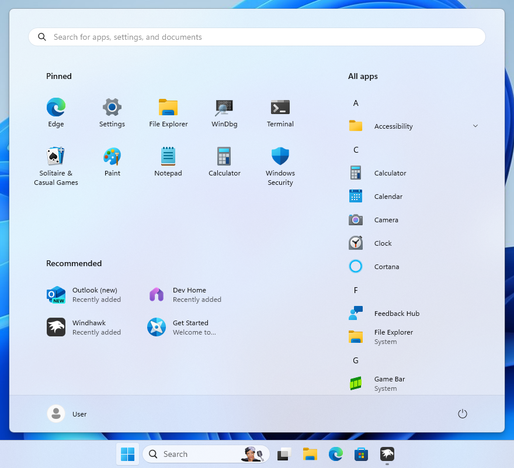

# SideBySide theme for Windows 11 Start Menu Styler

**Author**: kaoshipaws ([https://k4oshi.top/](https://k4oshi.top/))



## Theme selection

The theme is integrated into the mod, and can be simply selected from the mod's
settings:

* Open the Windows 11 Start Menu Styler mod in Windhawk.
* Go to the "Settings" tab.
* Select the theme and save the settings.

## Manual installation

The theme styles can also be imported manually. To do that, follow these steps:

* Open the Windows 11 Start Menu Styler mod in Windhawk.
* Go to the "Advanced" tab.
* Copy the content below to the text box under "Mod settings" and click "Save".

<details>
<summary>Content to import (click to expand)</summary>

```json
{
  "controlStyles[0].target": "Windows.UI.Xaml.Controls.Grid#UndockedRoot",
  "controlStyles[0].styles[0]": "Visibility=Visible",
  "controlStyles[0].styles[1]": "MaxWidth=700",
  "controlStyles[0].styles[2]": "Margin=0,0,300,0",
  "controlStyles[1].target": "Windows.UI.Xaml.Controls.Grid#AllAppsRoot",
  "controlStyles[1].styles[0]": "Visibility=Visible",
  "controlStyles[1].styles[1]": "Width=350",
  "controlStyles[1].styles[2]": "Transform3D:=<CompositeTransform3D TranslateX=\"-602\" />",
  "controlStyles[2].target": "StartDocked.AllAppsGridListView > ScrollViewer > Border > Grid > ScrollContentPresenter > ItemsPresenter > TileGrid",
  "controlStyles[2].styles[0]": "Transform3D:=<CompositeTransform3D TranslateX=\"20\" />",
  "controlStyles[3].target": "Grid#AllAppsPaneHeader",
  "controlStyles[3].styles[0]": "Transform3D:=<CompositeTransform3D TranslateX=\"20\" />",
  "controlStyles[4].target": "Windows.UI.Xaml.Controls.Button#CloseAllAppsButton",
  "controlStyles[4].styles[0]": "Visibility=Collapsed",
  "controlStyles[5].target": "StartDocked.StartSizingFrame",
  "controlStyles[5].styles[0]": "MinWidth=850",
  "controlStyles[5].styles[1]": "MaxWidth=850",
  "controlStyles[6].target": "Windows.UI.Xaml.Controls.Grid#ShowMoreSuggestions",
  "controlStyles[6].styles[0]": "Visibility=Collapsed",
  "controlStyles[7].target": "Windows.UI.Xaml.Controls.Button#ShowAllAppsButton",
  "controlStyles[7].styles[0]": "Visibility=Collapsed",
  "controlStyles[8].target": "Windows.UI.Xaml.Controls.ContentControl",
  "controlStyles[8].styles[0]": "Transform3D:=<CompositeTransform3D TranslateX=\"-200\" />",
  "controlStyles[9].target": "Windows.UI.Xaml.Controls.GridView#RecommendedList > Windows.UI.Xaml.Controls.Border > Windows.UI.Xaml.Controls.ScrollViewer#ScrollViewer > Windows.UI.Xaml.Controls.Border#Root > Windows.UI.Xaml.Controls.Grid > Windows.UI.Xaml.Controls.ScrollContentPresenter#ScrollContentPresenter > Windows.UI.Xaml.Controls.ItemsPresenter > Windows.UI.Xaml.Controls.ItemsWrapGrid > Windows.UI.Xaml.Controls.GridViewItem",
  "controlStyles[9].styles[0]": "MaxWidth=220",
  "controlStyles[9].styles[1]": "MinWidth=100"
}
```
</details>
