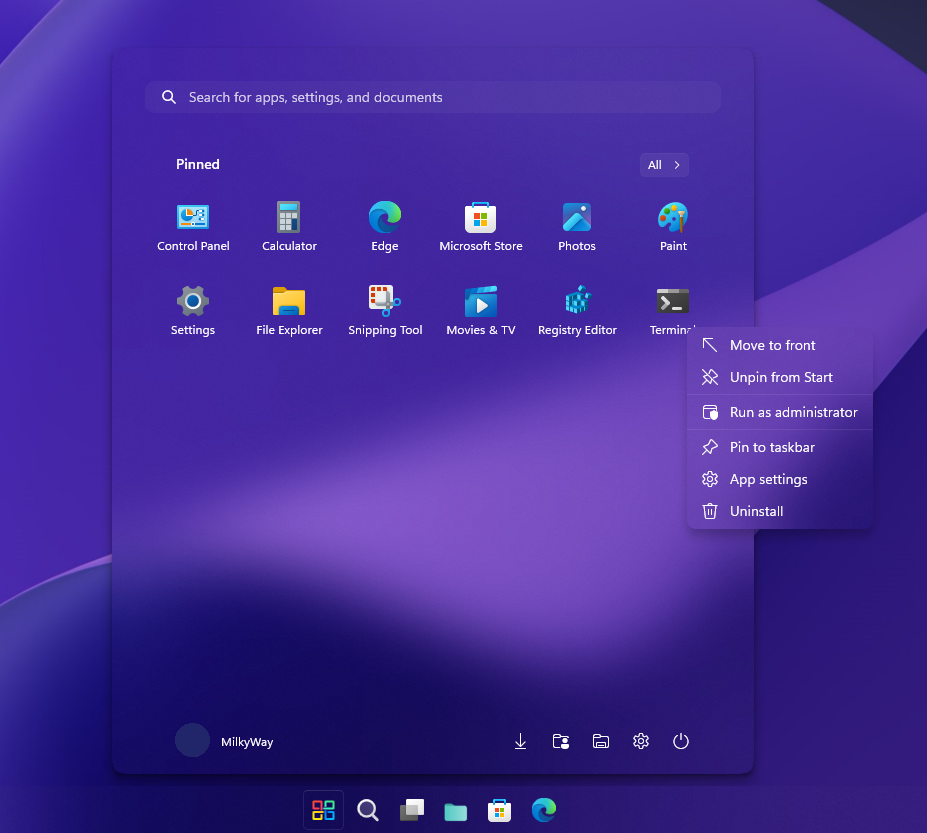

# TranslucentStartMenu theme for Windows 11 Start Menu Styler

A theme with a clear view of start menu acrylic background.

**Author**: [Undisputed00x](https://github.com/Undisputed00x)



## Theme selection

The theme is integrated into the mod, and can be simply selected from the mod's
settings:

* Open the Windows 11 Start Menu Styler mod in Windhawk.
* Go to the "Settings" tab.
* Select the theme and save the settings.

## Manual installation

The theme styles can also be imported manually. To do that, follow these steps:

* Open the Windows 11 Start Menu Styler mod in Windhawk.
* Go to the "Advanced" tab.
* Copy the content below to the text box under "Mod settings" and click "Save".

<details>
<summary>Content to import (click to expand)</summary>

```json
{
  "controlStyles[0].target": "Border#AcrylicBorder",
  "controlStyles[0].styles[0]": "CornerRadius=15",
  "controlStyles[0].styles[1]": "Background:=<AcrylicBrush TintColor=\"Transparent\" TintLuminosityOpacity=\"0\" TintOpacity=\"0\" Opacity=\"1\" FallbackColor=\"#000000\"/>",
  "controlStyles[0].styles[2]": "BorderThickness=0,0,0,0",
  "controlStyles[1].target": "Border#AcrylicOverlay",
  "controlStyles[1].styles[0]": "Visibility=Collapsed",
  "controlStyles[2].target": "Border#BorderElement",
  "controlStyles[2].styles[0]": "CornerRadius=10",
  "controlStyles[2].styles[1]": "BorderThickness=0,0,0,0",
  "controlStyles[2].styles[2]": "Background:=<AcrylicBrush TintLuminosityOpacity=\"0.03\" TintOpacity=\"0\" Opacity=\"1\" FallbackColor=\"#000000\"/>",
  "controlStyles[3].target": "Grid#ShowMoreSuggestions",
  "controlStyles[3].styles[0]": "Visibility=Collapsed",
  "controlStyles[4].target": "Grid#SuggestionsParentContainer",
  "controlStyles[4].styles[0]": "Visibility=Collapsed",
  "controlStyles[5].target": "Grid#TopLevelSuggestionsListHeader",
  "controlStyles[5].styles[0]": "Visibility=Collapsed",
  "controlStyles[6].target": "StartMenu.PinnedList",
  "controlStyles[6].styles[0]": "Height=504",
  "controlStyles[7].target": "MenuFlyoutPresenter",
  "controlStyles[7].styles[0]": "Background:=<AcrylicBrush TintColor=\"Transparent\" TintLuminosityOpacity=\"0\" TintOpacity=\"0\" Opacity=\"1\" FallbackColor=\"#000000\"/>",
  "controlStyles[7].styles[1]": "BorderThickness=0,0,0,0"
}
```
</details>

## TranslucentSearchMenu Support

<details>
<summary>Expand</summary>

To add this feature go to Start Menu Styler > **Advanced** > **Custom process
inclusion list**, add `SearchHost.exe` to the process list and click save.


Copy the JSON code to Start Menu Styler > **Advanced** > inside **Mod settings**
and click save.

```json
{
  "controlStyles[0].target": "Border#AcrylicBorder",
  "controlStyles[0].styles[0]": "CornerRadius=15",
  "controlStyles[0].styles[1]": "Background:=<AcrylicBrush TintColor=\"Transparent\" TintLuminosityOpacity=\"0\" TintOpacity=\"0\" Opacity=\"1\" FallbackColor=\"#000000\"/>",
  "controlStyles[0].styles[2]": "BorderThickness=0,0,0,0",
  "controlStyles[1].target": "Border#AcrylicOverlay",
  "controlStyles[1].styles[0]": "Visibility=Collapsed",
  "controlStyles[2].target": "Border#BorderElement",
  "controlStyles[2].styles[0]": "CornerRadius=10",
  "controlStyles[2].styles[1]": "BorderThickness=0,0,0,0",
  "controlStyles[2].styles[2]": "Background:=<AcrylicBrush TintLuminosityOpacity=\"0.03\" TintOpacity=\"0\" Opacity=\"1\" FallbackColor=\"#000000\"/>",
  "controlStyles[3].target": "Grid#ShowMoreSuggestions",
  "controlStyles[3].styles[0]": "Visibility=Collapsed",
  "controlStyles[4].target": "Grid#SuggestionsParentContainer",
  "controlStyles[4].styles[0]": "Visibility=Collapsed",
  "controlStyles[5].target": "Grid#TopLevelSuggestionsListHeader",
  "controlStyles[5].styles[0]": "Visibility=Collapsed",
  "controlStyles[6].target": "StartMenu.PinnedList",
  "controlStyles[6].styles[0]": "Height=504",
  "controlStyles[7].target": "MenuFlyoutPresenter",
  "controlStyles[7].styles[0]": "Background:=<AcrylicBrush TintColor=\"Transparent\" TintLuminosityOpacity=\"0\" TintOpacity=\"0\" Opacity=\"1\" FallbackColor=\"#000000\"/>",
  "controlStyles[7].styles[1]": "BorderThickness=0,0,0,0",
  "controlStyles[8].target": "Border#AppBorder",
  "controlStyles[8].styles[0]": "Background:=<AcrylicBrush TintColor=\"Transparent\" TintLuminosityOpacity=\"0\" TintOpacity=\"0\" Opacity=\"1\" FallbackColor=\"#000000\"/>",
  "controlStyles[8].styles[1]": "BorderThickness=0,0,0,0",
  "controlStyles[9].target": "Border#AccentAppBorder",
  "controlStyles[9].styles[0]": "Background:=<AcrylicBrush TintColor=\"Transparent\" TintLuminosityOpacity=\"0\" TintOpacity=\"0\" Opacity=\"1\" FallbackColor=\"#000000\"/>",
  "controlStyles[9].styles[1]": "BorderThickness=0,0,0,0",
  "controlStyles[10].target": "Border#LayerBorder",
  "controlStyles[10].styles[0]": "Visibility=Collapsed",
  "controlStyles[11].target": "Border#TaskbarSearchBackground",
  "controlStyles[11].styles[0]": "Background:=<AcrylicBrush TintColor=\"Transparent\" TintLuminosityOpacity=\"0.03\" TintOpacity=\"0\" Opacity=\"1\" FallbackColor=\"#000000\"/>",
  "controlStyles[11].styles[1]": "CornerRadius=10",
  "controlStyles[11].styles[2]": "BorderThickness=0,0,0,0"
}
```
</details>
