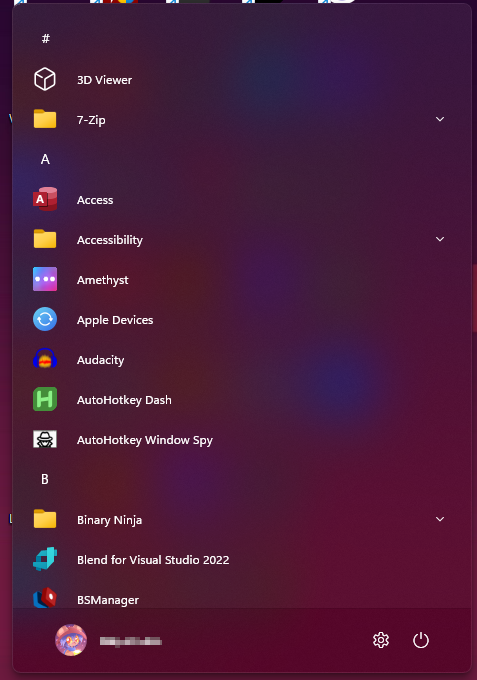

# Windows11_Metro10Minimal theme for Windows 11 Start Menu Styler

A minimalist version of Windows11_Metro10.

**Author**: [Y2K4](https://github.com/y2k04)

**Author of base theme**: [Ian Div](https://github.com/iandiv)



## Theme selection

The theme is integrated into the mod, and can be simply selected from the mod's
settings:

* Open the Windows 11 Start Menu Styler mod in Windhawk.
* Go to the "Settings" tab.
* Select the theme and save the settings.

## Manual installation

The theme styles can also be imported manually. To do that, follow these steps:

* Open the Windows 11 Start Menu Styler mod in Windhawk.
* Go to the "Advanced" tab.
* Copy the content below to the text box under "Mod settings" and click "Save".

<details>
<summary>Content to import (click to expand)</summary>

```json
{
  "theme": "Windows11_Metro10",
  "controlStyles[0].target": "StartMenu.StartInnerFrame",
  "controlStyles[0].styles[0]": "Visibility=Collapsed",
  "controlStyles[1].target": "Grid#AllAppsPaneHeader",
  "controlStyles[1].styles[0]": "Visibility=Collapsed",
  "controlStyles[2].target": "Button#ZoomOutButton",
  "controlStyles[2].styles[0]": "Visibility=Collapsed",
  "controlStyles[3].target": "SemanticZoom#ZoomControl",
  "controlStyles[3].styles[0]": "IsZoomOutButtonEnabled=False",
  "controlStyles[4].target": "Grid#UndockedRoot",
  "controlStyles[4].styles[0]": "MaxWidth=0",
  "controlStyles[4].styles[1]": "Margin=0",
  "controlStyles[5].target": "StartDocked.StartSizingFrame",
  "controlStyles[5].styles[0]": "MaxWidth=460",
  "controlStyles[5].styles[1]": "MinWidth=460",
  "controlStyles[6].target": "Grid#RootContent",
  "controlStyles[6].styles[0]": "MinWidth=460",
  "controlStyles[7].target": "Grid#InnerContent",
  "controlStyles[7].styles[0]": "Margin=0,12,0,0",
  "controlStyles[8].target": "Grid#AllAppsRoot",
  "controlStyles[8].styles[0]": "Transform3D:=<CompositeTransform3D TranslateX=\"-542\" />",
  "controlStyles[8].styles[1]": "Margin=0",
  "controlStyles[8].styles[2]": "Width=540",
  "controlStyles[9].target": "Border#AcrylicBorder",
  "controlStyles[9].styles[0]": "Background:=<AcrylicBrush TintColor=\"{ThemeResource CardStrokeColorDefaultSolid}\" FallbackColor=\"{ThemeResource CardStrokeColorDefaultSolid}\" TintOpacity=\"0\" TintLuminosityOpacity=\".85\" Opacity=\"1\"/>",
  "controlStyles[9].styles[1]": "BorderBrush:=<AcrylicBrush TintColor=\"{ThemeResource SurfaceStrokeColorDefault}\" FallbackColor=\"{ThemeResource SurfaceStrokeColorDefault}\" TintOpacity=\"0\" TintLuminosityOpacity=\".25\" Opacity=\"1\"/>",
  "controlStyles[9].styles[2]": "BorderThickness=1",
  "controlStyles[10].target": "Border#AppBorder",
  "controlStyles[10].styles[0]": "Background:=<AcrylicBrush TintColor=\"{ThemeResource CardStrokeColorDefaultSolid}\" FallbackColor=\"{ThemeResource CardStrokeColorDefaultSolid}\" TintOpacity=\"0\" TintLuminosityOpacity=\".85\" Opacity=\"1\"/>",
  "controlStyles[10].styles[1]": "BorderBrush:=<AcrylicBrush TintColor=\"{ThemeResource SurfaceStrokeColorDefault}\" FallbackColor=\"{ThemeResource SurfaceStrokeColorDefault}\" TintOpacity=\"0\" TintLuminosityOpacity=\".25\" Opacity=\"1\"/>",
  "controlStyles[11].target": "Border#LayerBorder",
  "controlStyles[11].styles[0]": "Visibility=1"
}
```
</details>
